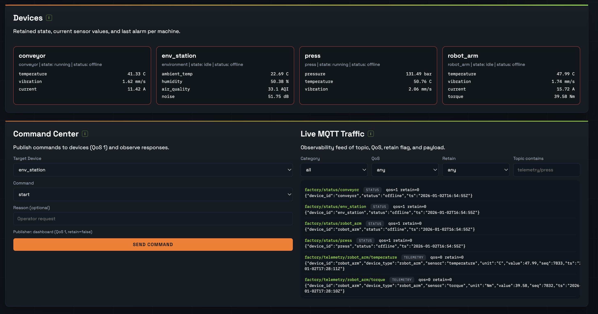

# Virtual Factory MQTT Sandbox

A local, hands-on MQTT playground that simulates a small industrial factory. It ships with machines, sensors, alarms, a controller, a traffic observer, and a live dashboard so you can explore MQTT concepts in a realistic setting.

## What This Demonstrates

- Topic hierarchy and wildcards
- QoS differences (0 vs 1)
- Retained messages
- Last Will and Testament (LWT) online/offline signaling
- Persistent vs clean sessions
- Basic access control (publish/subscribe ACLs)
- Observability and debugging of MQTT traffic
- Failure and fault scenarios

## Requirements

- Python 3.10+
- Docker (for the Mosquitto broker)

## Quick Start

```bash
./scripts/bootstrap.sh
./scripts/start.sh
```

Then open the dashboard:

```
http://localhost:8080
```

Broker port is mapped to `1884` to avoid conflicts with any local MQTT services.
Clients default to `VF_BROKER_PORT=1884` and can override with environment variables.

To stop everything:

```bash
./scripts/stop.sh
```

If you need a hard stop for any background processes:

```bash
pkill -f "vfactory."
./scripts/stop.sh
```

Run in the background:

```bash
nohup ./scripts/start.sh > vfactory-run.log 2>&1 &
```

## Dashboard Screenshot

Devices, command center, and live traffic view:



## Topic Structure

```
factory/
  telemetry/<device>/<sensor>
  alarms/<device>/<sensor>
  commands/<publisher>/<device>
  state/<device>
  status/<device>
```

Payloads are JSON and include timestamps (`ts`), device identifiers (`device_id`), and values.
For commands, `publisher` is typically `controller` or `dashboard`.

## Components

- `vfactory.device`: Simulated machine or environment station (telemetry + alarms + LWT + retained state)
- `vfactory.controller`: Central logic that reacts to alarms and issues commands
- `vfactory.dashboard`: Web UI for status, values, traffic, and command publishing
- `vfactory.observer`: Passive observer that subscribes to `factory/#`
- `vfactory.cli`: Lightweight publish/subscribe tool
- `vfactory.bad_actor`: Triggers ACL rejections to show permission errors

## MQTT Behavior Highlights

- **QoS 0**: Telemetry (`factory/telemetry/...`)
- **QoS 1**: Alarms and commands (`factory/alarms/...`, `factory/commands/...`)
- **Retained**: Device state + online/offline status (`factory/state/...`, `factory/status/...`)
- **LWT**: Devices publish `offline` automatically on abrupt disconnects
- **ACLs**: The broker uses client-id patterns in `config/acl` to restrict who can publish to which topic trees

## Suggested Exercises

1. **Wildcard subscriptions**
   - `python -m vfactory.cli sub --topic 'factory/telemetry/+/temperature' --qos 0`
   - `python -m vfactory.cli sub --topic 'factory/+/robot_arm/#' --qos 1`

2. **QoS differences**
   - Stop the observer and compare QoS 0 telemetry (lost while offline) vs QoS 1 alarms (delivered reliably).

3. **Retained messages**
   - Restart the dashboard and observe instant state/online status without waiting for new messages.

4. **LWT (online/offline)**
   - Run `python -m vfactory.device --device press --crash-after 10` in a separate terminal.
   - Watch `factory/status/press` flip to `offline` via LWT.

5. **Persistent vs clean sessions**
   - Start the controller with a persistent session:
     ```bash
     python -m vfactory.controller --session persistent
     ```
   - Stop it for 30 seconds while alarms occur, then restart it to see queued QoS 1 alarms delivered.
   - Or run everything with a persistent controller: `python scripts/run_all.py --controller-session persistent`

6. **Access control (ACLs)**
   - Run `python -m vfactory.bad_actor` to attempt unauthorized publish/subscribe.
   - Observe `Not authorized` logs in the broker (`docker compose logs -f mosquitto`).

7. **Fault injection**
   - Start `scripts/run_all.py --anomaly` to inject occasional out-of-range values and alarms.

## Manual MQTT Interaction

Publish a command (stop the dashboard first or reuse its client id):

```bash
python -m vfactory.cli pub \
  --client-id dashboard \
  --topic factory/commands/dashboard/conveyor \
  --message '{"command":"stop","reason":"manual"}' \
  --qos 1
```

Subscribe to all traffic:

```bash
python -m vfactory.cli sub --topic 'factory/#' --qos 1
```

## Notes

- The Mosquitto ACL uses client-id patterns (no username/password). It demonstrates topic-based permissions but is not hardened security.
- The dashboard connects over WebSocket to a local Python server (`vfactory.dashboard`) that subscribes to `factory/#`.

## Troubleshooting

- Confirm the broker is running: `docker compose ps`
- Inspect broker logs: `docker compose logs -f mosquitto`
- Change broker host/port with environment variables:
  - `VF_BROKER_HOST`, `VF_BROKER_PORT`
